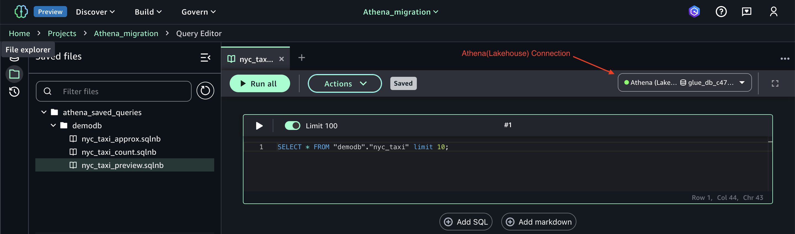

# Migrating Amazon Athena resources to Amazon SageMaker Unified Studio (Preview)

This guide helps [Amazon Athena](https://docs.aws.amazon.com/athena/latest/ug/what-is.html) users access their existing Athena resources within [Amazon SageMaker Unified Studio (Preview)](https://docs.aws.amazon.com/sagemaker-unified-studio/latest/userguide/what-is-sagemaker-unified-studio.html). It covers:
1. Migrating Athena's [saved queries](https://docs.aws.amazon.com/athena/latest/ug/saved-queries.html) from a single [workgroup](https://docs.aws.amazon.com/athena/latest/ug/workgroups-manage-queries-control-costs.html) of Athena to a SageMaker Unified Studio [project](https://docs.aws.amazon.com/sagemaker-unified-studio/latest/userguide/projects.html)
2. Configuring a project to work with an existing Athena workgroup
3. Updating the project's AWS [Identity and Access Management](https://docs.aws.amazon.com/IAM/latest/UserGuide/introduction.html) (IAM) role with an existing IAM role that has permissions to access the Athena workgroup and catalog resources (databases and tables) used by the saved queries

## Considerations and Limitations

- You can configure one workgroup per project
- All project members can access saved queries migrated to a project
- This does not support Athena workgroups configured to use the Spark engine
- Migration of existing Athena workgroups and saved queries in [EMR Studio](https://docs.aws.amazon.com/us_en/emr/latest/ManagementGuide/emr-studio-athena.html) are not supported

## Prerequisites

Before proceeding with migration, ensure you have:

- Understanding of [Amazon SageMaker Unified Studio](https://docs.aws.amazon.com/sagemaker-unified-studio/latest/adminguide/what-is-sagemaker-unified-studio.html)
- Access to a [domain](https://docs.aws.amazon.com/sagemaker-unified-studio/latest/adminguide/working-with-domains.html) and a project created in SageMaker Unified Studio (Refer to [Create a new project](https://docs.aws.amazon.com/sagemaker-unified-studio/latest/userguide/create-new-project.html))
- At least one Athena workgroup that was not created as part of SageMaker Unified Studio project creation
- Saved queries in an Athena workgroup that you intend to use in SageMaker Unified Studio project
- Python, [boto3](https://pypi.org/project/boto3/) and [nbformat](https://pypi.org/project/nbformat/) installed on the machine where you'll execute migration steps
- The IAM User/Role performing the steps in this guide should have the following permissions:

```json
{
    "Version": "2012-10-17",
    "Statement": [
        {
            "Effect": "Allow",
            "Action": [
                "athena:ListNamedQueries",
                "athena:GetNamedQuery",
                "athena:TagResource"
            ],
            "Resource": "arn:aws:athena:<region>:<aws-account-id>:workgroup/<your-workgroup-name>"
        },
        {
            "Effect": "Allow",
            "Action": [
                "codecommit:GetBranch",
                "codecommit:CreateCommit"
            ],
            "Resource": "arn:aws:codecommit:<region>:<aws-account-id>:<repo-name>"
        },
        {
            "Effect": "Allow",
            "Action": [
                "datazone:ListConnections",
                "datazone:UpdateConnection"
            ],
            "Resource": "*"
        }
    ]
}
```
Step 1.2 below shows how to fetch the repo for the project. While the above sample uses "*” for some of the Resources, consider restricting it according to your security requirements.
- Add the IAM user/role as the [domain's owner](https://docs.aws.amazon.com/sagemaker-unified-studio/latest/adminguide/user-management.html) and the [project's owner](https://docs.aws.amazon.com/sagemaker-unified-studio/latest/userguide/add-project-members.html) to be able to execute steps in this guide

## Steps
### 1. Migrate saved queries to SageMaker Unified Studio's project
This step copies all the saved queries from an existing Athena workgroup to the SageMaker Unified Studio's code repository as ``.sqlnb`` files. These files can be opened in the query editor of the project.
1. Log into the SageMaker Unified Studio console, select your project and click on **Project Overview**.
2. Note you can find ``domain-id`` and ``project-id`` from the **Project details** section of **Project overview** page
3. Clone the GitHub repository:
```
$ git clone https://github.com/aws/Unified-Studio-for-Amazon-Sagemaker.git
$ cd Unified-Studio-for-Amazon-Sagemaker
```
4. Execute the migration script. Replace ``<workgroupname>`` with the name of the workgroup where saved queries exist in Athena, ``<domain-id>`` with the SageMaker Unified Studio's domain ID, ``<project-id>`` with the project's ID, ``<aws-account-id>`` with your AWS account ID and ``<region>`` with the desired region (for example, ``us-east-1``)
```
$ python -m migration.athena.athena_workgroup_migration \
--workgroup-name <workgroupname> \
--domain-id <domain-id> \
--project-id <project-id> \
--account-id <aws-account-id> \
--region <region>
```

### 2. Update the project IAM role of SageMaker Unified Studio
The migrated Athena queries will access existing databases and tables in the Glue Catalog and federated connections in the Athena catalog. The default SageMaker Unified Studio project's role will not have a) access to these catalog resources by default and b) permission to execute queries in the existing workgroup configured above. To provide the required access, you can use an existing role that you use in Athena as the project role. Please refer to [Bring your own role guide](https://github.com/aws/Unified-Studio-for-Amazon-Sagemaker/tree/main/migration/bring-your-own-role) for guidance. Here, is an example CLI command for the same:
```
$ python3 bring_your_own_role.py use-your-own-role \
    --domain-id <SageMaker-Unified-Studio-Domain-Id> \
    --project-id <SageMaker-Unified-Studio-Project-Id> \
    --bring-in-role-arn <Custom-IAM-Role-Arn> \
    --region <region-code> \
    --endpoint <endpoint-url>
```
## Executing Migrated Queries in SageMaker Unified Studio
Once the above steps are completed, perform following steps:

1. Sign into the SageMaker Unified Studio portal and select your project.
2. Navigate to Build → Query Editor.
3. In the File Explorer, find your migrated queries as .sqlnb files under ``athena_saved_queries/<workgroup-name>``.
4. Click on a ``.sqlnb`` file to open in the query editor.
5. Select the Athena (Lakehouse) connection, desired catalog, and database.
6. Click "Run" to execute the query.

